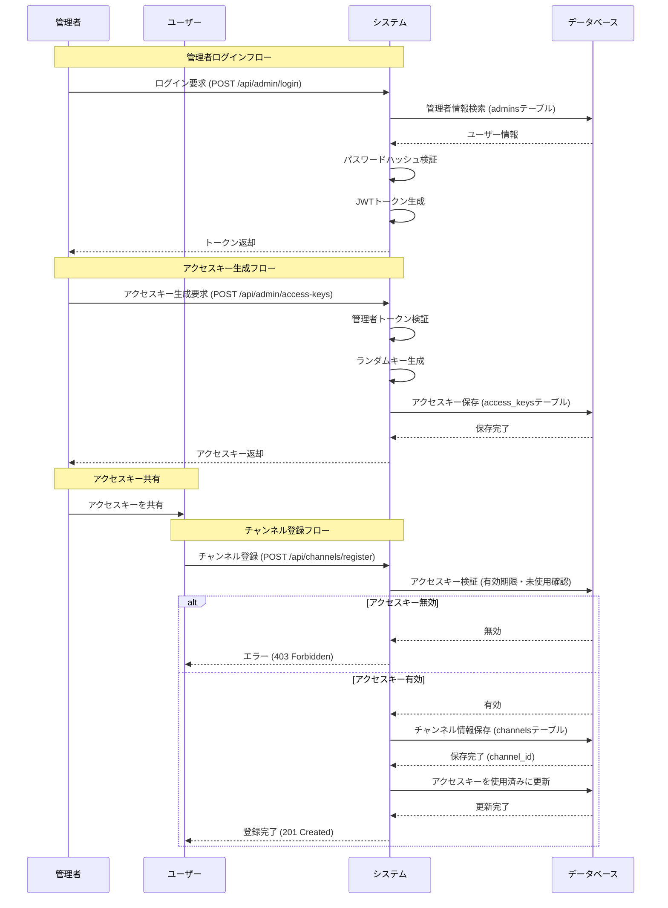

# 管理・認証フロー

## 概要

管理者によるログイン、アクセスキーの発行、およびそれを使用したチャンネル登録のフローです。

## フロー図

## 関連API

| エンドポイント | メソッド | 説明 | 認証 |
| --- | --- | --- | --- |
| `/api/admin/login` | POST | 管理者ログイン | 不要 |
| `/api/admin/access-keys` | POST | アクセスキー生成 | 要 (Admin JWT) |
| `/api/channels/register` | POST | チャンネル登録 | 不要 (アクセスキー認証) |
