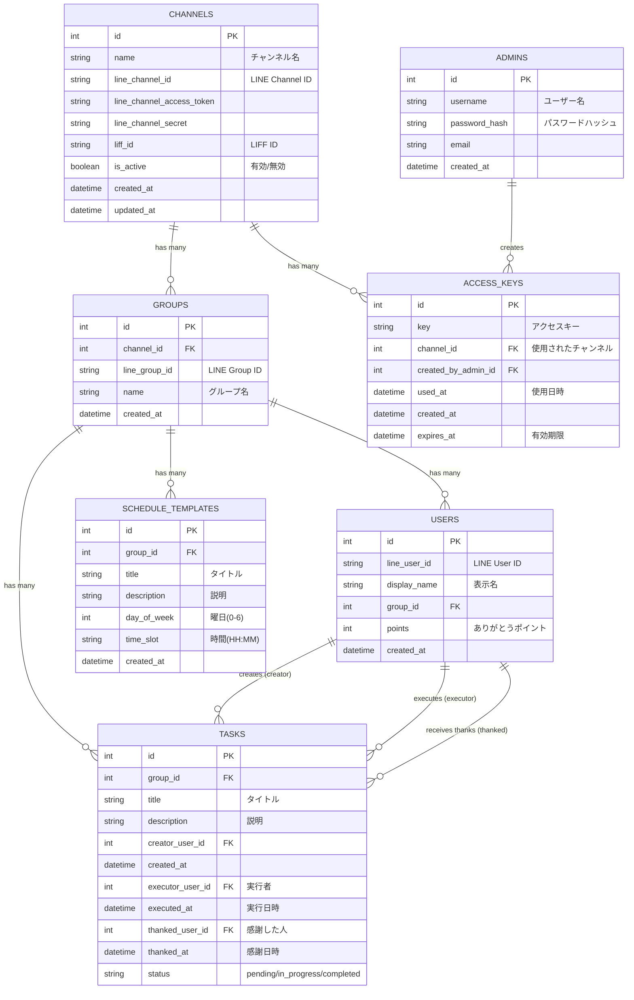

# データベース構造

## 概要

このプロジェクトでは Cloudflare D1 (SQLite) を使用しています。
マルチテナント設計を採用しており、`channels` テーブルが最上位のテナントとなります。

## ER図

## テーブル詳細

### channels (LINEチャンネル)
最上位のテナント単位です。1つのLINE公式アカウントに対応します。

### groups (グループ)
LINEのグループトークに対応します。各グループは1つのチャンネルに属します。

### users (ユーザー)
グループ内のユーザーです。`line_user_id` と `group_id` の複合ユニーク制約により、グループごとにユーザー情報を管理しています。

### tasks (タスク)
グループ内のタスクです。作成者、実行者、感謝した人のIDを保持します。

### admins (管理者)
アプリケーション全体の管理者です。チャンネルの管理やアクセスキーの発行を行います。
