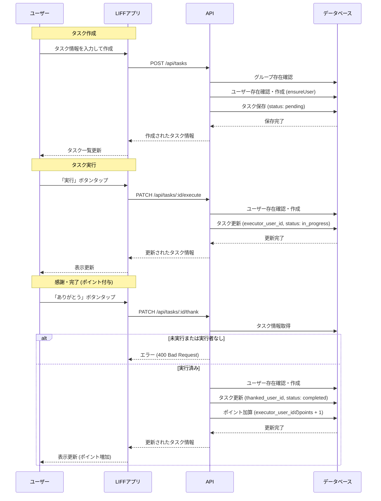

# タスク管理フロー

## 概要

LIFFアプリを通じたタスクの作成、実行、および感謝（完了）のフローです。ゲーミフィケーション要素として、感謝時にポイントが付与されます。

## フロー図

## ステータス遷移

| ステータス | 説明 | 遷移条件 |
| --- | --- | --- |
| `pending` | 未着手 | タスク作成時の初期状態 |
| `in_progress` | 進行中/実行済 | 誰かがタスクを実行した状態 |
| `completed` | 完了 | 実行に対して「ありがとう」が送られた状態 |

## 関連API

| エンドポイント | メソッド | 説明 |
| --- | --- | --- |
| `/api/tasks` | POST | タスク作成 |
| `/api/tasks` | GET | タスク一覧取得 |
| `/api/tasks/:id/execute` | PATCH | タスク実行 |
| `/api/tasks/:id/thank` | PATCH | ありがとう送信（完了） |
